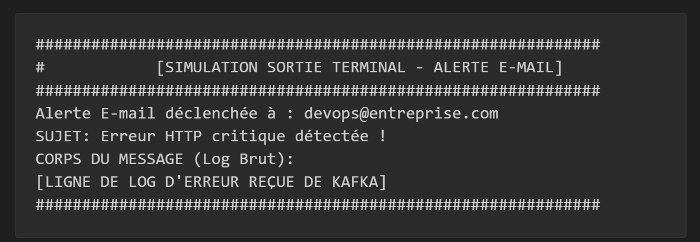

## 💻 Sujet de TP : Pipeline de Traitement d'Erreurs de Logs HTTP

### 🎯 Objectifs du TP

1.  Mettre en place un jeu de données (logs) contenant des cas de succès et des erreurs.
2.  Développer un script **Producteur** simulant un service de *log-processing* capable de filtrer les erreurs $4xx$ et $5xx$.
3.  Développer un script **Consommateur** simulant un service d'alerte qui reçoit les erreurs critiques via Kafka et déclenche une notification par e-mail (simulée).

### 📜 Partie 1 : Le Jeu de Données et les Règlements

Paramètre,Valeur Recommandée,Justification
Topic,http_errors_topic,Nom utilisé dans les scripts Python.
Partitions,3,Permet la parallélisation du traitement par les consommateurs (bonne pratique).
Replication-Factor,1,Suffisant pour un environnement de TP local (une seule machine/broker).

#### 1.1 Fichier de Logs (`access.log`)

Créez un fichier de logs contenant le jeu d'essai suivant. Chaque ligne est au format `IP - Utilisateur [Date] "Requête" Statut Taille Referer Agent`.

| Log (Exemple) | Statut | Catégorie |
| :--- | :--- | :--- |
| `192.168.1.10 - user_a [16/Dec/2025:10:30:01 +0100] "GET /index.html HTTP/1.1" 200 1250 "-" "Mozilla/5.0"` | **200** | Succès |
| `10.0.0.1 - - [16/Dec/2025:10:30:10 +0100] "GET /config.json HTTP/1.1" 404 150 "-" "Wget"` | **404** | Erreur Client |
| `10.0.0.5 - - [16/Dec/2025:10:30:15 +0100] "POST /submit/form HTTP/1.1" 500 500 "-" "PHP-Client"` | **500** | Erreur Serveur |
| `192.168.1.20 - user_c [16/Dec/2025:10:30:12 +0100] "GET /secure/page HTTP/1.1" 401 250 "-" "Mozilla/5.0"` | **401** | Erreur Client |
| `192.168.1.1 - admin [16/Dec/2025:10:30:25 +0100] "DELETE /resource/123 HTTP/1.1" 500 50 "-" "Custom-App"` | **500** | Erreur Serveur |
| `172.16.0.10 - user_d [16/Dec/2025:10:30:20 +0100] "GET /images/logo.png HTTP/1.1" 200 45000 "http://site.com/" "Chrome"` | **200** | Succès |

#### 1.2 Configuration (Simulée)

  * **Topic Kafka :** `http_errors_topic`
  * **Destinataire de l'alerte :** `devops@entreprise.com`

-----

### 🛠️ Partie 2 : Script Producteur (Log Processor)

Le rôle de ce script est de lire le fichier de logs, d'identifier les lignes problématiques, et de les publier sur Kafka.

#### 2.1 Directives d'Implémentation

1.  **Librairies :** Utiliser la librairie `kafka-python` pour l'envoi vers Kafka.
2.  **Lecture :** Ouvrir et lire le fichier `access.log` ligne par ligne.
3.  **Extraction :** Utiliser une **expression régulière (regex)** pour extraire le code de statut HTTP (les trois chiffres situés avant la taille du *body*).
4.  **Filtrage :** Implémenter une logique conditionnelle pour vérifier le code de statut :
      * Si le statut est **entre 400 et 599** (inclus), la ligne est considérée comme une erreur et doit être envoyée à Kafka.
      * Sinon (statut $2xx$, $3xx$, etc.), la ligne est ignorée ou marquée comme succès.
5.  **Production Kafka :** Si une erreur est détectée :
      * Instancier un `KafkaProducer` pointant vers un *broker* (par exemple, `localhost:9092`).
      * Envoyer la ligne de log complète comme message au topic `http_errors_topic`. **Le message doit être encodé en octets (e.g., UTF-8).**

-----

### 📧 Partie 3 : Script Consommateur et Alerte (Alerter)

Le rôle de ce script est de s'abonner au topic d'erreurs et de réagir à chaque message en simulant une alerte par e-mail.

#### 3.1 Directives d'Implémentation

1.  **Librairies :** Utiliser la librairie `kafka-python` pour la consommation.
2.  **Consommation Kafka :**
      * Instancier un `KafkaConsumer` abonné au topic `http_errors_topic`.
      * Le consommateur doit boucler indéfiniment, attendant de nouveaux messages.
3.  **Traitement des Messages :**
      * Pour chaque message reçu, décoder la valeur du message (qui est la ligne de log d'erreur) en chaîne de caractères (string).
4.  **Simulation d'Envoi d'E-mail (SM) :**
      * Créer une fonction nommée, par exemple, `send_alert_email(log_error, recipient)`.
      * **Cette fonction NE DOIT PAS envoyer de vrai e-mail.** Elle doit imprimer une sortie formatée au terminal (SM - Simulation Sortie Terminal) pour prouver qu'une alerte est déclenchée.

**Format de la Sortie Terminale (SM) :**

5.  **Exécution :** Lancer le script producteur (Partie 2) puis, dans un terminal séparé, lancer le script consommateur (Partie 3) pour observer le flux des données et le déclenchement des alertes.

