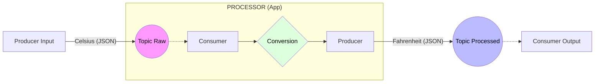

### 🟢 1. L'Ingestion (Le Producteur) Le script `producer.py` joue le rôle d'une passerelle. Il récupère les données (qui pourraient venir de capteurs réels) et les envoie dans Kafka.

* **Format :** Il transforme un dictionnaire Python en **JSON**, puis en **Bytes** (car Kafka ne comprend que les octets).
* **Organisation :** Les données sont envoyées dans le topic `temperatures_celsius_raw`.

### 🔵 2. Le Traitement (Le Processor) C'est le composant le plus important (`processor.py`). Il possède une double casquette :

* **Côté Consommateur :** Il "écoute" en permanence le topic brut. Dès qu'une température arrive, il l'attrape.
* **Côté Transformation :** Il décode le JSON, extrait la valeur en Celsius, et applique la formule mathématique. Il enrichit souvent la donnée (ajout d'un timestamp ou d'un statut).
* **Côté Producteur :** Sans attendre, il renvoie le résultat transformé vers un nouveau topic (`temperatures_fahrenheit_processed`).

### 🔴 3. La Distribution (Le Consommateur Final) Le script `consumer_output.py` est l'utilisateur final de la donnée.

* Il ne voit jamais la donnée brute en Celsius.
* Il ne reçoit que de la donnée "propre", déjà calculée et prête à être affichée sur un tableau de bord ou stockée dans une base de données.

---

